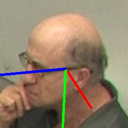
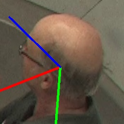
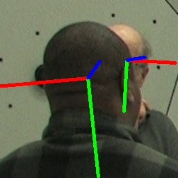
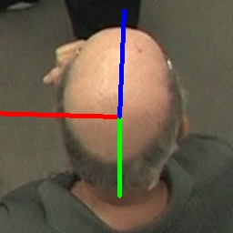
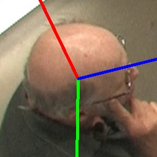
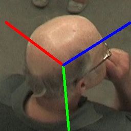

**Paper titled: Head Pose Estimation Based on 5D Rotation Representation [here](https://ieeexplore.ieee.org/abstract/document/10651821)**


<table>
<tr>
<td></td>
<td></td> 
<td></td> 
<td></td> 
<td></td>
<td></td> 
<td></td> 
<td></td> 
</tr>
</table>

* **Fig.** Snapshots of 7 different views from one sequence in the CMU Panoptic val-set dataset.


### Evaluation of the MAE for different methods on the CMU dataset

| **Method**                                       | **R** | **RR** | **Yaw** | **Pitch** | **Roll** | **MAE** |
|--------------------------------------------------|-------|--------|---------|-----------|----------|---------|
|                                                         **Narrow range: -90° < yaw < 90°**                    |
| DirectMHP [Zhou et al., 2023]                    | ✅     | E      | 5.86    | 8.25      | 7.25     | 7.12    |
| DirectMHP [Zhou et al., 2023]                    | ❌     | E      | 5.75    | 8.01      | 6.96     | 6.91    |
| 5DResNet (ours)                                  | ✅     | 5D     | **5.01**| **6.89**  | **6.00** | **5.97**|
|                                               **Full range: -180° < yaw < 180°**                     |
| Cobo et al. [Cobo et al., 2024]                  | ❌     | E      | -       | -         | -        | 10.47   |
| Viet et al. [Viet et al., 2021]                  | ❌     | RM     | 9.55    | 11.29     | 8.32     | 9.72    |
| Cobo et al. [Cobo et al., 2024]                  | ❌     | Q      | -       | -         | -        | 9.32    |
| DirectMHP [Zhou et al., 2023]                    | ✅     | E      | 7.38    | 8.56      | 7.47     | 7.80    |
| DirectMHP [Zhou et al., 2023]                    | ❌     | E      | 7.32    | 8.54      | 7.35     | 7.74    |
| WHENet [Zhou et al., 2020]                       | ❌     | E      | 8.51    | 7.67      | 6.78     | 7.65    |
| Cobo et al. [Cobo et al., 2024]                  | ❌     | 6D     | -       | -         | -        | 7.45    |
| 5DResNet (ours)                                  | ✅     | 5D     | **5.96**| **7.68**  | **6.28** | **6.64**|

RR: Rotation Representation.
R: Retraining.

# Dataset

* **CMU Panoptic**  from [here](http://domedb.perception.cs.cmu.edu/) for the full range angles.
  


  


## Training:


```
python3 train_5D_Resnet.py
```


## Testing:

```
python3 test_Resnet.py
```


# Citing

```
@inproceedings{algabri2024head,
  title={Head Pose Estimation Based on 5D Rotation Representation},
  author={Algabri, Redhwan and Lee, Sungon},
  booktitle={2024 IEEE Symposium on Wireless Technology \& Applications (ISWTA)},
  pages={195--199},
  year={2024},
  organization={IEEE}
}
```

